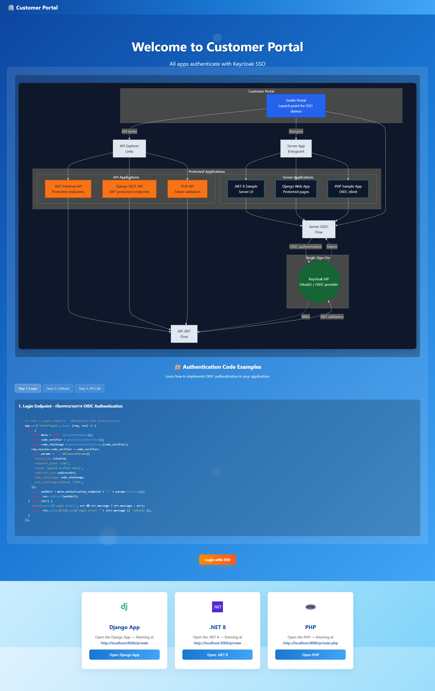
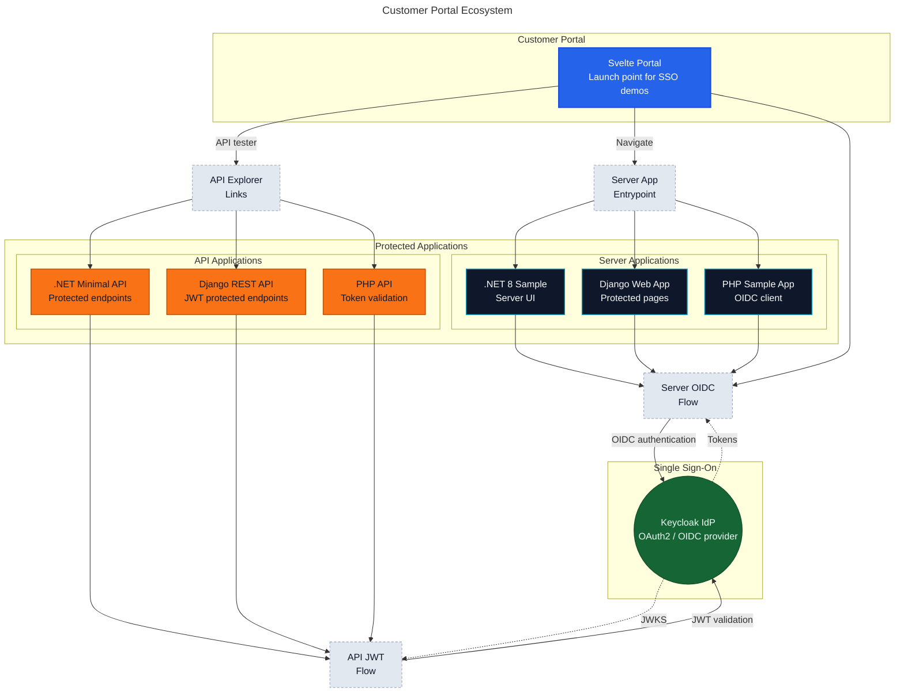

# Customer Portal Ecosystem

ระบบ Customer Portal พร้อม SSO (Single Sign-On) ที่ integrates กับ Keycloak สำหรับ authentication และ authorization ครอบคลุมทั้ง Web Applications และ REST APIs ในหลายภาษา



## 📋 ภาพรวม

**Customer Portal** เป็น hub หลักที่เขียนด้วย Svelte ทำหน้าที่เป็นจุดเริ่มต้นในการเข้าถึงระบบต่างๆ ผ่าน **OAuth2/OIDC** โดยใช้ **Keycloak** เป็น Identity Provider

### สถาปัตยกรรม



## 🏗️ โครงสร้างโปรเจค

### 🌐 Portal & Frontend
- **`svelte-portal/`** — Customer Portal หลัก (Svelte)
  - จุดเริ่มต้นสำหรับเข้าถึง Server Apps และ API Explorer
  - รองรับ SSO login ผ่าน Keycloak

### 🖥️ Server Applications (OIDC Flow)
- **`dotnet8/`** — .NET 8 Web App | Port: 5000
- **`django/`** — Django Web App | Port: 8000  
- **`php/`** — PHP OIDC Sample | Port: 8080

### 🔌 REST API Applications (JWT Validation)
- **`dotnet8-api/`** — .NET 8 Minimal API | Port: 5001
- **`django-api/`** — Django REST Framework | Port: 8001
- **`php-api/`** — PHP JWT API | Port: 8081

## 🔐 การทำงานของ Authentication

### Server Apps (Authorization Code Flow)
1. User คลิกเข้า app ผ่าน Portal
2. Redirect ไป Keycloak login
3. Keycloak ส่ง authorization code กลับมา
4. App แลก code เป็น access token
5. ใช้ token เข้าถึง protected pages

### REST APIs (JWT Bearer Token)
1. Client ส่ง request พร้อม `Authorization: Bearer <token>`
2. API validate JWT กับ Keycloak JWKS
3. ตรวจสอบ signature, expiration, issuer
4. อนุญาตเข้าถึง endpoint หรือ reject

## 🚀 การรันโปรเจค

### Prerequisites
- Docker & Docker Compose
- Keycloak ที่ configure แล้ว

### Quick Start

```powershell
# เข้าไปในโฟลเดอร์ของโปรเจคที่ต้องการ
cd svelte-portal

# Build และรัน container
docker compose up --build -d

# ดู logs
docker compose logs -f

# หยุด container
docker compose down
```

### ทดสอบทุกโปรเจค

| โปรเจค | คำสั่ง | URL |
|--------|--------|-----|
| Svelte Portal | `cd svelte-portal && docker compose up -d` | http://localhost:3000 |
| .NET App | `cd dotnet8 && docker compose up -d` | http://localhost:5000 |
| Django App | `cd django && docker compose up -d` | http://localhost:8000 |
| PHP App | `cd php && docker compose up -d` | http://localhost:8080 |
| .NET API | `cd dotnet8-api && docker compose up -d` | http://localhost:5001 |
| Django API | `cd django-api && docker compose up -d` | http://localhost:8001 |
| PHP API | `cd php-api && docker compose up -d` | http://localhost:8081 |

## 🛠️ Development Workflow

1. **แก้ไขโค้ด** ในโปรเจคที่ต้องการ
2. **Rebuild image** หลังแก้ไข
   ```powershell
   docker compose up --build -d
   ```
3. **ทดสอบด้วย curl** (ใช้ `curl.exe` บน Windows)
   ```powershell
   curl.exe -H "Authorization: Bearer <token>" http://localhost:5001/api/weather
   ```

## 🔧 Configuration

แต่ละโปรเจคมี `docker-compose.yml` และ environment variables สำหรับ:
- Keycloak connection (realm, client ID, secret)
- Database configuration
- Port mappings
- Volume mounts

ดูรายละเอียดใน `README.md` ของแต่ละโปรเจค

## 📦 Docker Images

ทุกโปรเจครองรับการรันในรูปแบบ container พร้อม:
- ✅ Multi-stage builds สำหรับ optimize size
- ✅ Health checks
- ✅ Environment-based configuration
- ✅ Volume mounts สำหรับ development

## 🔍 Debugging

```powershell
# ดู running containers
docker ps -a

# เข้าไปใน container
docker exec -it <container_name> /bin/bash

# ดู logs
docker compose logs -f <service_name>

# Restart service
docker compose restart <service_name>
```

## 📚 เอกสารเพิ่มเติม

- [Keycloak Documentation](https://www.keycloak.org/documentation)
- [OAuth 2.0 / OIDC Spec](https://oauth.net/2/)
- แต่ละโปรเจคมี `README.md` เฉพาะที่อธิบายการ setup และ configuration

---

**Note:** ระบบนี้ออกแบบมาเพื่อเป็น demo และ learning purpose สำหรับการทำ SSO integration ในภาษาและ framework ต่างๆ
